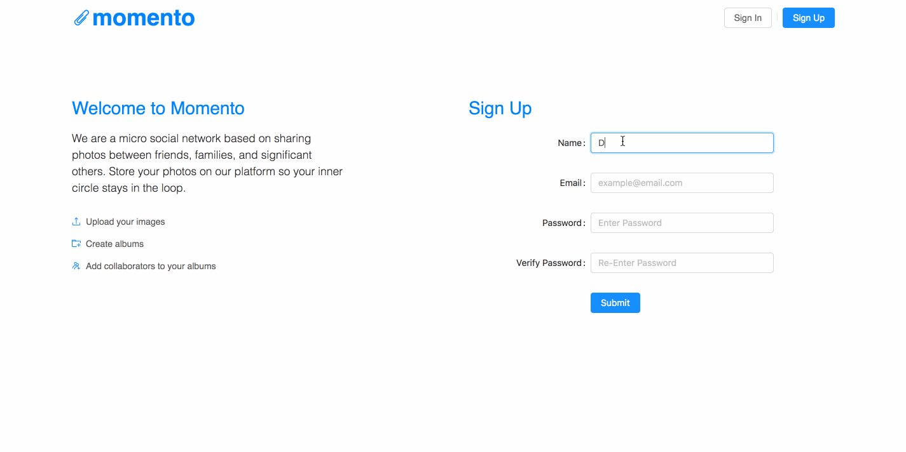
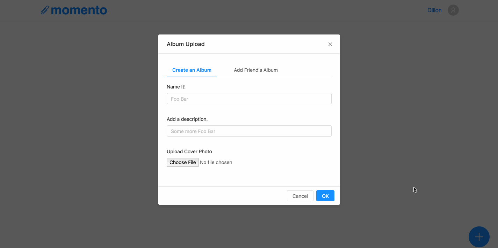

# Momento

<!-- Header Image -->
<!--  -->

Momento is a micro social network that allows users to upload pictures to online albums. Unlike Facebook or Instagram, Momento allows multiple users to contribute to the same album making it perfect for weddings, family outings or
Just sharing memories in the moment. 

- - - -

## What is the Purpose of This App?

We wanted to create an application for anyone that has ever taken a picture and had a friend or loved one tap them them on the shoulder and say “Hey, send that to me!”
Having to send pictures out via text message every time you take a picture is annoying and outdated. THERE HAS TO BE A BETTER WAY! 

## The App in Action

We allow the user to sign up to create an account, or log into an existing account to take them to their own dashboard that holds their personal albums.
<!-- Gif here -->
  

By pressing the "plus" button while on the dashboard, the user can create a new album or add a friend's album to their own dashboard.
<!-- Gif here -->


By pressing the "plus" button in the album page, the user can upload photos from their personal drives or, if on mobile, take a photo and add it to that album, allowing other users to view it and comment on it.
<!-- Gif here -->


## Tools Used

Front-End Tools: 
* [Adobe XD](https://www.adobe.com/products/xd.html?sdid=12B9F15S&mv=search&s_kwcid=AL!3085!3!247395684636!e!!g!!adobe%20xd&ef_id=WdHfMQAAAF_wo3l0:20180421044352:s): used for wireframing and mockups
* [React](https://reactjs.org/): framework for building out the app
* [Ant Design](http://ant.design): A component library designed and maintained by Ant Financial

Back-End Tools:
* [Node.js](https://nodejs.org/en/): used for server-side scripting
* [Express](https://expressjs.com/): used as our server
* [Mongo](https://www.mongodb.com/): used as our database
* [Nekodb](https://www.npmjs.com/package/nekodb): used as our ODM
* [Jest](https://facebook.github.io/jest/): used for testing

## Deployed Version

You can view a [deployed version here](https://momento-sp.herokuapp.com/)


## Installing

You can run this app locally by following these steps:

``` bash
# install dependencies
yarn install

# serve with hot reload at localhost:3000
yarn start

# build for production with minification
yarn build
```